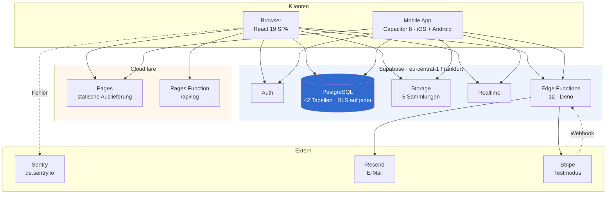
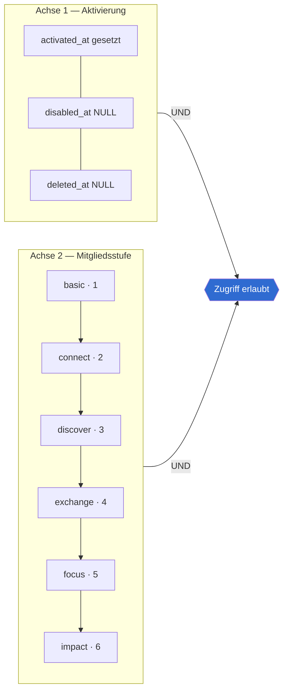
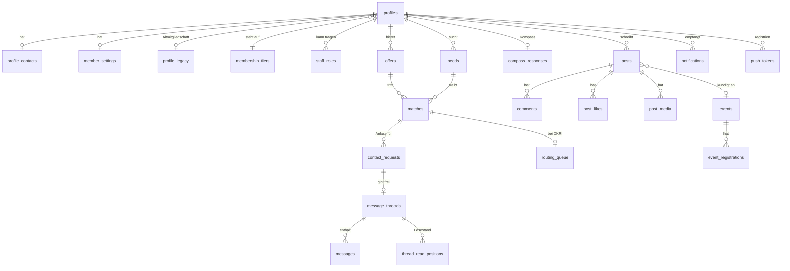
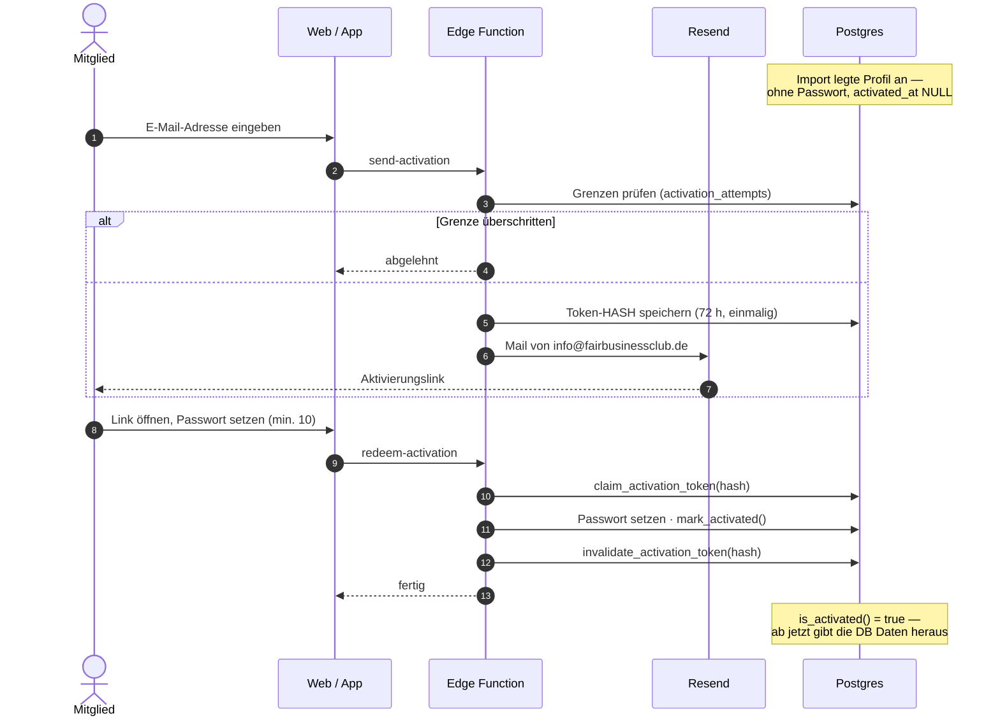
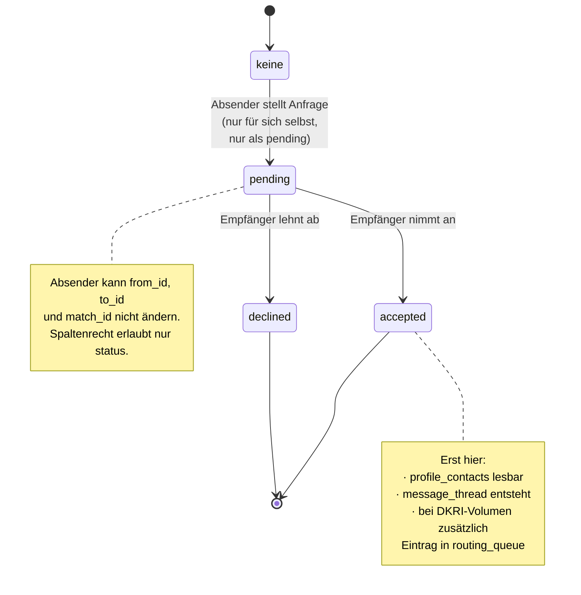
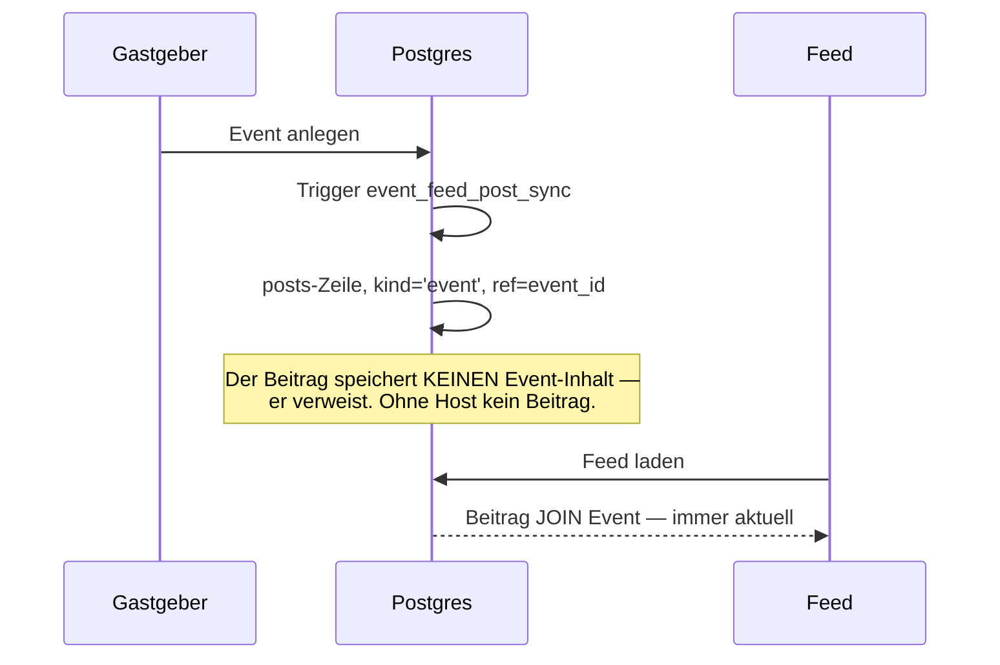
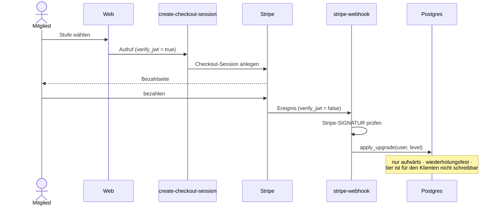
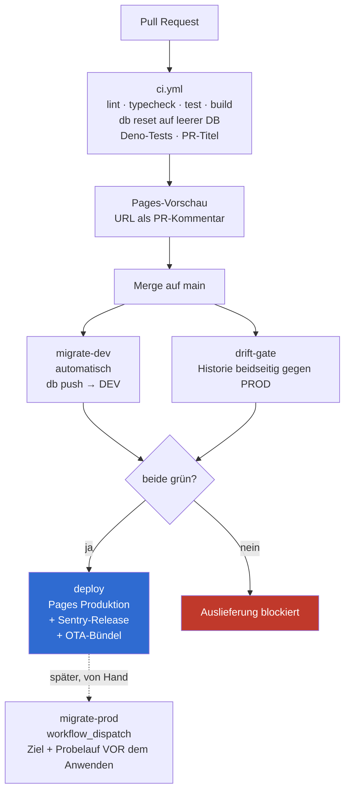
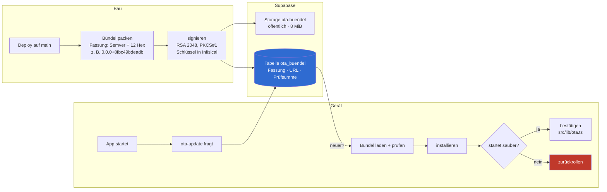

# Technisches Handbuch — eff.bee.zee / fbc-platform

**Stand 31.08.2026 · Fassung 1.0**
Repository: `agenticapps-eu/fbc-platform`

> Dieses Handbuch beschreibt den **Ist-Stand**. Die fachlichen Anforderungen
> und die Entscheidungshistorie stehen im [Lastenheft](./lastenheft.md).
>
> **Verbindliche Quellen bleiben der Code.** Wo dieses Handbuch von
> `openspec/specs/` oder `supabase/migrations/` abweicht, haben jene recht.
> Dieses Dokument ordnet ein, es ersetzt nicht.
>
> **`README.md` ist veraltet** — es beschreibt den Prototypstand vom Juni.
> Nicht als Einstieg verwenden.

---

## Inhalt

1. [Architektur im Überblick](#1-architektur-im-überblick)
2. [Technologie-Stack](#2-technologie-stack)
3. [Das Rechtemodell](#3-das-rechtemodell)
4. [Datenmodell](#4-datenmodell)
5. [Zentrale Abläufe](#5-zentrale-abläufe)
6. [Frontend](#6-frontend)
7. [Serverfunktionen](#7-serverfunktionen)
8. [Umgebungen und Auslieferung](#8-umgebungen-und-auslieferung)
9. [Mobile App und Aktualisierung über die Luft](#9-mobile-app-und-aktualisierung-über-die-luft)
10. [Qualitätssicherung](#10-qualitätssicherung)
11. [Betrieb](#11-betrieb)
12. [Arbeitsweise am Code](#12-arbeitsweise-am-code)
13. [Bekannte Schwachstellen](#13-bekannte-schwachstellen)

---

## 1. Architektur im Überblick

Die Plattform ist eine Single-Page-Anwendung auf einer verwalteten
Postgres-Plattform. Es gibt **keinen eigenen Anwendungsserver**. Der Browser
spricht direkt mit der Datenbank — abgesichert dadurch, dass die Datenbank
selbst jede Zeile gegen den Anfragenden prüft.



**Drei Eigenschaften, die den Rest erklären:**

1. **Die Sicherheitsgrenze ist die Datenbank.** Kein Anwendungsserver
   dazwischen bedeutet: Die Zugriffsregeln müssen in Postgres stehen, nicht
   im Klienten. Das Frontend ist Komfort.
2. **Web-Build und App sind dasselbe Artefakt.** Capacitor packt den
   ausgelieferten Web-Build in eine native Hülle. Es gibt kein zweites
   Repository und keinen zweiten Codepfad.
3. **Serverfunktionen gibt es nur, wo die Datenbank nicht reicht** — wo ein
   externes Geheimnis nötig ist (Stripe, Resend), wo ein unauthentifizierter
   Aufruf ankommt (Webhook, Aktivierungslink), oder wo die Rechte des
   Aufrufers bewusst überschritten werden müssen (Admin-Funktionen).

---

## 2. Technologie-Stack

| Schicht | Technologie | Version |
|---|---|---|
| UI | React, React DOM | ^19.2.8 |
| Build | Vite | ^8.2.2 |
| Sprache | TypeScript (strict) | ^6.0.3 |
| Gestaltung | Tailwind CSS | ^4.3.3 |
| Routing | react-router-dom | ^7.18.2 |
| Datenzugriff | @tanstack/react-query | ^5.102.8 |
| Formulare | react-hook-form + zod | ^7.86 / ^4.4 |
| Animation | framer-motion | ^13.1.1 |
| Diagramme | recharts | ^3.10.1 |
| Backend-Klient | @supabase/supabase-js | ^2.112.4 |
| Fehlerprotokoll | @sentry/react | ^10.71.0 |
| Mobile Hülle | @capacitor/core, ios, android | ^8 |
| App-Aktualisierung | @capgo/capacitor-updater | 8.51.15 |
| Paketverwaltung | pnpm | 9.12.0 |
| Auslieferung | wrangler (Cloudflare) | 4.127.0 |
| Tests | vitest | ^4.1.11 |
| Test-Hilfen | @testing-library/react | ^16.3.3 |

---

## 3. Das Rechtemodell

Das wichtigste Kapitel. Wer hier etwas ändert, ändert die Sicherheit des
Systems.

### 3.1 Zwei Achsen, die unabhängig voneinander gelten



**Eine hohe Stufe ersetzt die Aktivierung nicht.** Ein nie aktiviertes Konto
auf `impact` bekommt keine Mitgliederdaten. Diese Regel steht ausdrücklich in
`openspec/specs/access-control/spec.md` und war die Antwort darauf, dass beim
Import 70 Konten auf höchster Stufe angelegt wurden, deren Inhaber sich noch
nie ausgewiesen hatten.

### 3.2 Die fünf Prüffunktionen

Alle sind `SECURITY DEFINER` mit festgezurrtem `search_path`. Ausführungsrecht
haben nur `authenticated` und, wo nötig, `service_role` — **niemals `anon`**.

| Funktion | Rückgabe | Prüft |
|---|---|---|
| `is_activated()` | boolean | Konto des Aufrufers bestätigt, nicht gesperrt, nicht gelöscht |
| `current_tier_rank()` | int (1–6) | Rang der eigenen Mitgliedsstufe |
| `has_level(p_min_rank int)` | boolean | Eigener Rang ≥ Schwelle |
| `is_admin()` | boolean | Zeile in `staff_roles` mit Rolle `admin` |
| `is_matching_manager()` | boolean | Zeile in `staff_roles` mit Rolle `matching_manager` |

`is_prime_plus()` existiert nicht mehr — die Funktion wurde nach AGE-311
gelöscht, nachdem alle sieben abhängigen Regeln auf `has_level()` umgehängt
waren.

### 3.3 Wie eine Regel aussieht

Das durchgehende Muster: Eine Tabelle hat RLS aktiviert. Ohne passende Regel
wird abgelehnt. Interaktionstabellen delegieren an ihr Elternobjekt.

```
posts        →  sichtbar, wenn is_activated() UND Sichtbarkeit passt
comments     →  sichtbar, wenn der Elternbeitrag sichtbar ist
post_likes   →  schreibbar, wenn der Elternbeitrag sichtbar ist
```

So lässt sich die Sichtbarkeit eines Beitrags nicht über die Kommentartabelle
umgehen.

### 3.4 Die Falle bei `SECURITY DEFINER`

Wo eine solche Funktion die Sichtbarkeitsbedingung einer Tabelle
**nachbildet**, statt sich auf deren Regeln zu stützen, muss die Nachbildung
mitgepflegt werden. Ein Gate, das den Regeln hinzugefügt wird, muss im
selben Zug in diese Funktionen — sonst **ist die Funktion der Weg um das
Gate herum**. Das steht so in der Spezifikation, weil es einmal passiert ist.

### 3.5 Rollen sind serverseitig

`profiles.roles` ist ein Anzeigefeld („Unternehmer · Investor") und vom
Mitglied selbst beschreibbar. Es taugt **nicht** zur Autorisierung. Die
echten Rollen liegen in `staff_roles` — nur über `service_role` oder
Admin-SQL setzbar, der Klient darf nur seine eigene Zeile lesen (ADR-0002).

---

## 4. Datenmodell

### 4.1 Kernentitäten



### 4.2 Alle 42 Tabellen nach Bereich

| Bereich | Tabellen |
|---|---|
| **Mitglieder** | `profiles` · `profile_contacts` · `profile_interests` · `profile_legacy` · `profile_badges` · `profile_theme_scores` · `member_settings` · `membership_tiers` · `badges` · `goals` |
| **Zugang** | `activation_tokens` · `activation_attempts` · `staff_roles` · `platform_settings` |
| **Kompass / Matching** | `compass_responses` · `offers` · `needs` · `matches` · `routing_queue` |
| **Kontakt / Chat** | `contact_requests` · `message_threads` · `messages` · `thread_read_positions` |
| **Aktivität** | `posts` · `comments` · `post_likes` · `post_saves` · `post_media` · `tags` |
| **Events** | `events` · `event_registrations` |
| **Benachrichtigung** | `notifications` · `push_tokens` · `push_routing` · `push_zustellungen` |
| **Verwaltung** | `admin_audit` · `feedback` · `release_notes` · `release_entry_skips` |
| **Partner** | `partners` · `partner_categories` |
| **App-Update** | `ota_buendel` |

### 4.3 Dateiablage

Fünf Sammlungen, jede per Migration angelegt mit Größenbegrenzung und
erlaubten Dateitypen:

| Sammlung | Inhalt | Öffentlich |
|---|---|---|
| `avatars` | Profilbilder | ja |
| `covers` | Profil-Hintergrundbilder | ja |
| `post-media` | Beitragsbilder | nein — Lesbarkeit folgt dem Beitrag |
| `event-covers` | Event-Titelbilder | nein — Lesbarkeit folgt dem Event |
| `ota-buendel` | App-Aktualisierungspakete | ja — Inhalt ist ohnehin öffentlich |

> **`event-covers` auf der Entwicklungsumgebung nicht leeren.** Die acht
> Objekte dort stammen aus dem Spiegel und werden von keinem Skript
> wiederhergestellt. Steht als ausdrückliches Verbot in
> `openspec/specs/design-system/spec.md`.

### 4.4 Ausgewählte Serverfunktionen

Neben den Prüffunktionen aus 3.2:

| Funktion | Zweck |
|---|---|
| `search_directory(...)` | Verzeichnissuche mit Facetten, inklusive Kompass-Filter |
| `generate_matches_for(profile)` | Übereinstimmungen serverseitig erzeugen |
| `recompute_my_matches()` | Eigene Matches neu berechnen |
| `register_for_event(event)` | Anmeldung mit Kapazitätsprüfung |
| `event_attendees(event)` | Teilnehmerauflösung für Berechtigte |
| `claim_activation_token(hash)` | Aktivierungstoken einlösen |
| `mark_activated(profile)` | Konto bestätigen |
| `admin_list_members(...)` | Mitgliederliste inklusive unbestätigter |
| `admin_update_profile(target, patch)` | Fremdes Profil ändern, mit Protokollspur |
| `resolve_display_name(owner, name)` | Namensauflösung, abhängig von Aktivierung des Betrachters |
| `unread_message_counts()` | Ungelesen-Zähler gegen den eigenen Lesestand |
| `post_engagement_counts(ids)` | Reaktionszahlen, nur für sichtbare Beiträge |
| `push_auftraege_faellig(max)` | Fällige Push-Zustellungen holen |

**Auslöserfunktionen** (Trigger) tragen **kein** Ausführungsrecht für
API-Rollen — sie feuern trotzdem, weil Postgres bei Triggern das Recht des
Aufrufers nicht prüft. Beispiele: `handle_new_user`,
`event_feed_post_sync`, `beitrag_ankuendigen`, `hinweis_neue_nachricht`.

---

## 5. Zentrale Abläufe

### 5.1 Aktivierung — vom Import zum nutzbaren Konto



**Warum kein Standardpasswort:** Eine Rundmail mit gemeinsamem Passwort in
BCC wurde am 13.08. verworfen — solche Mails werden weitergeleitet. Die
Kehrseite ist bekannt: Wer nicht mehr an seine hinterlegte Adresse kommt,
braucht einen Admin.

**Warum eigener Versand:** Supabase begrenzt Bestätigungsmails auf zwei pro
Stunde und lässt den Absender nicht wählen. Bei 70 Mitgliedern an einem
Abend unbrauchbar.

### 5.2 Kontaktanfrage — der Weg zu Kontaktdaten und Chat



Die Nebeneffekte der Annahme laufen **serverseitig** über einen Auslöser
(`handle_contact_request_change`), nicht im Klienten.

> **Aktuelle Abweichung:** `platform_settings.open_contact = true`, gesetzt am
> 05.08. als Sommerfest-Erbe, öffnet die Stufen-Schranke für Kontaktanfragen
> und hebt den Welpenschutz auf. Dokumentiert in AGE-598, nicht behoben.

### 5.3 Ein Event kündigt sich selbst an



**Warum verknüpft statt kopiert:** „Sonst steht im Feed morgen ein Titel, den
es nicht mehr gibt" (AGE-533).

### 5.4 Stufen-Upgrade über Stripe



**`verify_jwt = false` beim Webhook** ist kein Loch: Stripe trägt kein
Nutzer-Token. Der Schutz ist die Signaturprüfung.

---

## 6. Frontend

### 6.1 Umfang

32 Seiten (`src/pages`), 71 Komponenten (`src/components`) — zusammen 112
`.tsx`-Dateien ohne Tests. Dazu 222 Testdateien.

### 6.2 Routen

Die Hauptrouten stehen **nicht** einzeln in `App.tsx`, sondern kommen aus
`src/config/nav.ts` — dieselbe Liste erzeugt Navigation und Routen. Die
Rechtsseiten kommen aus `src/content/legal/meta.ts`.

**Aus `src/config/nav.ts`** — die `section` bestimmt, wo die Route im Menü
erscheint:

| Route | `section` | Zweck |
|---|---|---|
| `/` | entdecken | Startseite — angemeldet oder Schaufenster |
| `/academy` | entdecken | Academy |
| `/events` | entdecken | Events |
| `/mitglieder` | entdecken | Mitgliederverzeichnis mit Filtern |
| `/aktivitaet` | entdecken | Aktivitätsfeed |
| `/profil` | mein-bereich | Eigenes Profil |
| `/einstellungen` | mein-bereich | Einstellungen inkl. Theme |
| `/kompass` | sub | „Ich biete / Ich suche" |
| `/meine-events` · `/kontakte` · `/mitgliedschaft` | sub | Eigene Events, Kontakte, Stufe |
| `/profil/bearbeiten` | sub | Profil-Editor |
| `/chat` | sub | Gespräche |
| `/neues` | sub | Neues in der App |

Nur die Einträge mit `section` `entdecken` und `mein-bereich` stehen im
sichtbaren Menü — das sind genau die sieben aus dem Beschluss vom 04.08.
Alles unter `sub` ist erreichbar, aber nicht im Hauptmenü.

**Einzeln in `src/App.tsx` deklariert**, nicht in `nav.ts`:
`/events/:id` (Zeile 156) · `/p/:id` (147) · `/chat/:threadId` (136) sowie
die Verwaltungsrouten `/admin` · `/admin/mitglieder` ·
`/admin/mitglied/:id` · `/admin/feedback` · `/admin/neuigkeiten` (nur
`is_admin()`) und `/intern/routing` (nur Matching-Manager).

**Außerhalb des Anwendungsrahmens:**

| Route | Zugang |
|---|---|
| `/impressum` · `/datenschutz` · `/agb` · `/cookies` (aus `src/content/legal/meta.ts`) | ohne Konto, ohne Aktivierung |
| `/login` · `/aktivierung` · `/passwort-vergessen` · `/passwort-neu` | ohne Konto |
| `/onboarding` · `/willkommen` | **hinter `RequireAuth` und `ActivationGate`** (App.tsx 264, 281) |
| `/styleguide` | nur bedingt gemountet (App.tsx 291) |

**Weiterleitungen** halten alte Adressen am Leben:
`/mein-bereich`→`/profil` · `/meine-kurse`→`/academy` ·
`/community`→`/aktivitaet` · `/verzeichnis`→`/mitglieder` ·
`/compass`→`/kompass` · `/angebote-gesuche`→`/kompass` ·
`/matching`→`/` · `/meine-chancen`→`/`.

Die letzten beiden sind der sichtbare Rest der **stillgelegten**
Matching-Oberfläche: Der Code ist vollständig da, die Einstiege sind es
nicht.

**Sichtbare Navigation seit dem 04.08.:** Start · Academy · Events ·
Mitglieder · Aktivität · Mein Profil · Einstellungen. Nichts wurde gelöscht,
nur unerreichbar gemacht.

### 6.3 Gestaltungssystem

Zwei Themes über **ein** Vokabular an Gestaltungswerten. Das Theme wird vor
dem ersten Bildaufbau gesetzt (kein Aufblitzen) und ist eine Einstellung des
Mitglieds.

> **„navy" ist kein Dunkelmodus.** Der navy-Block in `src/index.css:208–222`
> überschreibt ausschließlich die Chrome-Werte — Seitenleiste und Kopfzeile.
> Die Inhaltsschicht ist in beiden Themes identisch; die Spezifikation sagt
> das ausdrücklich (`openspec/specs/design-system/spec.md:17-20`). Einen
> Dark-Reading-Mode gibt es seit AGE-499 bewusst nicht.

| Wert | Token | Gilt |
|---|---|---|
| Akzent | `--color-accent: #2f6bd1` | in **beiden** Themes gleich |
| Akzent auf der Leiste | `--color-accent-on-chrome: #5b90e0` | nur navy-Chrome |
| Fließtext | `--color-ink: #1e2a3a` | in beiden gleich — nie reines Schwarz |

Schriften Fraunces und Inter, **von der eigenen Domain ausgeliefert**.

Bindende Regeln aus `openspec/specs/design-system/spec.md`:

- Gestaltungswerte sind der einzige Stilvertrag — keine losen Farbwerte
- Jede Inhaltsseite öffnet mit einem Bildkopf
- Jede Hauptseite öffnet leer mit einer Einladung, nicht mit einer Meldung
- Keine Seite lässt sich seitlich schieben
- Overlays halten die Seite dahinter still und den Fokus fest
- Farbe trägt nie allein eine Bedeutung
- Ein Kanon ordnet jedem Gegenstandsbereich Icon und Farbe zu
- Fremde Medienabspieler laden nur auf ausdrückliche Anforderung
- Eine Werbeaussage gegenüber Besuchern trägt eine Quelle

---

## 7. Serverfunktionen

Zwölf Edge Functions (Deno).

| Funktion | JWT-Prüfung | Zweck |
|---|---|---|
| `send-activation` | nein | Aktivierungslink verschicken |
| `resend-activation` | ja | Erneuter Link für ein angemeldetes Konto |
| `redeem-activation` | nein | Link einlösen, Passwort setzen |
| `notify-contact-request` | nein | Transaktionsmail zur Kontaktanfrage |
| `create-checkout-session` | ja | Stripe-Checkout starten |
| `stripe-webhook` | nein | **Einzige Autorität für Stufenwechsel** — Schutz ist die Signatur |
| `admin-change-email` | ja | Login-Adresse eines Mitglieds ändern |
| `admin-set-member-ban` | ja | Sperre setzen |
| `send-push` | nein | Push-Zustellung |
| `ota-update` | nein | Aktualisierungsmanifest ausliefern |
| `ota-channel` | nein | Kanalzuordnung |
| `ota-stats` | nein | Rückmeldungen der Geräte |

Geänderte Funktionen erreichen **beide** Projekte ohne Zutun — das ist als
Zusage in `openspec/specs/deployment-environments/spec.md` festgeschrieben.

---

## 8. Umgebungen und Auslieferung

### 8.1 Zwei Projekte, keine Umschaltung

| | DEV / DEMO | PROD |
|---|---|---|
| Projekt-Ref | `foelowldexkcqzewvrcf` | `viwntbodrtqxgmqyxluh` |
| Region | `eu-central-1` | `eu-central-1` |
| Inhalt | **Spiegel von PROD** seit 20.08.2026 | echte Mitglieder |
| Infisical-Umgebung | `dev` | `prod` |
| Erreicht durch | PR-Vorschauen, `pnpm dev` | Push auf `main` |
| Demo-Seed | nein, solange der Spiegel steht | **nie** |
| Auth-Konfiguration | Dashboard (bewusst nicht versioniert) | `supabase/config.toml` |
| Zugangsdaten | eigene | **eigene, nie geteilt** |

**Die Rollen sind fest.** Es gibt keinen Schalter. Ein Wechsel wäre: zwei
Werte in Infisical ändern plus neu ausliefern. Kein Anwendungscode kennt den
Unterschied.

**Cloudflare-Pages-Umgebungsvariablen sind wirkungslos.** Der Build läuft in
GitHub Actions unter `infisical run`; Vite backt die `VITE_*`-Werte zur
Build-Zeit ein, wrangler lädt nur fertige Dateien hoch.

### 8.2 Der Weg einer Änderung



**Warum DEV automatisch und PROD von Hand.** Der CI-Lauf belegt mit
`db reset` nur, dass eine Migration auf eine **leere** Datenbank passt. Eine
Pflichtspalte ohne Vorgabewert auf einer gefüllten Tabelle, ein Typwechsel an
Bestandswerten — beides ist in CI grün und scheitert erst an echten Daten.
Die Entwicklungsumgebung mit dem PROD-Spiegel ist die Generalprobe.

**Der Abgleich-Wächter wird auch rot, wenn er nicht messen kann.** Fehlendes
Geheimnis, Datenbank nicht erreichbar, geändertes Ausgabeformat. Ein Wächter,
der bei Nichtwissen grün wird, baut die Juni-Havarie eine Ebene höher nach.
Realer Fall: Am 05.08.2026 wechselte die Supabase-CLI zwischen 2.107.0 und
2.111.0 ihr Ausgabeformat von ASCII-Tabelle auf JSON; der damalige Auswerter
fand keine Zeile mehr. Rot wurde das Gate nur wegen der Kreuzprobe gegen die
Dateien im Repository.

**`migrate-dev` läuft bewusst nicht auf Pull Requests** — sonst mutierte jeder
offene PR die Entwicklungsdatenbank mit ungeprüften Migrationen, und zwei
parallele PRs schrieben sich gegenseitig in die Historie.

### 8.3 Geheimnisse

Alle Zugangsdaten liegen in **Infisical**, getrennt nach `dev` und `prod`.
Im Repository steht nur `.env.example` mit Platzhaltern. Befehle, die
Geheimnisse brauchen, laufen unter `infisical run` — die Werte gehen in den
Kindprozess und niemals in eine Datei oder nach `GITHUB_ENV`.

`pnpm build` bleibt bewusst ein reines `tsc && vite build` ohne
`infisical run`, damit CI ohne jedes Geheimnis übersetzen kann.

**Schreibende Befehle nennen ihr Ziel ausdrücklich** (`--db-url`,
`--project-ref`), nie über `supabase link`. Die Prüfung ist zweistufig:
maschinell gegen `scripts/prod-project-ref.txt`, dann durch den Menschen.

---

## 9. Mobile App und Aktualisierung über die Luft

### 9.1 Warum Capacitor

Entscheidung vom 27.08.2026, beide Plattformen gleichzeitig.

| Verworfen | Grund |
|---|---|
| **PWA** | Push funktioniert auf iOS nur, wenn der Nutzer die Seite selbst zum Homescreen legt. Bei rund 70 Mitgliedern jenseits der 40 ist das ein Support-Fall pro Person. Dazu keine Store-Präsenz |
| **React Native** | Teilt die Geschäftslogik, aber nicht die 107 Komponenten (Zählung vom 27.08., Seiten eingeschlossen) — Tailwind und DOM übertragen sich nicht, dazu 27 Dateien mit direktem Browserzugriff. Monate Arbeit, danach zwei Codebasen für einen Entwickler |

**Kein eigenes Repository.** `ios/` und `android/` liegen im selben Repo:
„Das ist der Sinn von Capacitor: Der Web-Build *ist* die App."

### 9.2 Der Aktualisierungsweg



**Die Bestätigung ist der kritische Teil.** `src/lib/ota.ts` ist ein
Nebenwirkungs-Modul **ohne Export**, in `main.tsx` als zweiter Import direkt
hinter `./instrument`. Der Import *ist* der Aufruf — es gibt keine Funktion,
die jemand zu rufen vergessen kann. Vergessen würde **jedes Gerät** bis zur
nächsten Store-Einreichung lahmlegen.

Ohne Plattformbedingung: Die Web-Umsetzung gibt nur ein eingebautes Bündel
zurück, kostet nichts und kann nicht scheitern. Ohne `await`: Ein
top-level `await` machte aus einer hakenden Brücke einen Startfehler — genau
den Zustand, gegen den das Modul steht.

**`autoDeleteFailed` steht auf `false`.** Am 31.08.2026 an der Quelle
gemessen: Mit `true` überschreibt das Aufräumen den soeben gesetzten
Fehlerstatus mit „gelöscht", und beim nächsten Start greift die
Abbruchprüfung nicht mehr — dasselbe kaputte Bündel wird erneut geladen.
Eine Endlosschleife. Nur das Gerät kann sie brechen; der Serverendpunkt kann
das nicht auffangen, weil nach dem Rückfall wieder die ältere Fassung läuft
und das kaputte Bündel weiterhin „später" ist.

**Die Fassungsnummer** entsteht in `scripts/ota-buendel.logic.ts` aus der
Version in `package.json` plus den ersten **12** Hex-Zeichen des Commits.
`package.json` steht derzeit auf `0.0.0` — jedes heute gebaute Bündel heißt
also `0.0.0+<12 Hex>`. Wer sprechende Fassungen will, muss die Version
pflegen.

**Warum Supabase und nicht Cloudflare R2** (ADR-0005): Der ursprüngliche
Entwurf legte den Dienst auf R2 mit der Begründung „steht bereits". Am
31.08. nachgemessen: R2 war nie eingerichtet — kein `wrangler.toml`, keine
Bindung. Die scheinbaren Treffer waren eine Risiko-Kennung `R2` in zwei
Abnahmedokumenten. Supabase Storage steht tatsächlich und spart ein
Geheimnis in einer zweiten Umgebung.

Das Bündel liegt öffentlich. Die Signatur trägt **Echtheit, nicht
Vertraulichkeit** — im Bündel steht derselbe Inhalt, den Cloudflare Pages
ohnehin ausliefert.

### 9.3 Push

Push nutzt **denselben Abschalter wie die Glocke in der App**. Zwei getrennte
Schalter für dasselbe Ereignis wären eine Falle. Der Nachrichteninhalt
erscheint **nicht** auf dem Sperrbildschirm — Sperrbildschirme liegen in
Besprechungen offen.

Tabellen: `push_tokens` (nur der Eigentümer), `push_routing`,
`push_zustellungen`. Ein `pg_cron`-Lauf wiederholt fehlgeschlagene
Zustellungen.

### 9.4 Was noch fehlt

| Punkt | Beleg |
|---|---|
| Eigene Domain `fbc.de` — blockiert die Deep Links | AGE-256 |
| **Kontolöschung im Produkt** — harte Bedingung des App Store | AGE-644 |
| Signaturmaterial: Zertifikat, Provisioning Profile, Keystore | AGE-642 |
| Gerätebelege auf beiden Plattformen | AGE-642 |
| Entscheidung: Store-Konto Einzelperson oder Firma | AGE-644 |

---

## 10. Qualitätssicherung

### 10.1 Was bei jeder Änderung läuft

| Prüfung | Werkzeug |
|---|---|
| Stil | `pnpm lint` (ESLint) |
| Typen | `pnpm typecheck` (`tsc --noEmit`) |
| Verhalten | `pnpm test` (vitest) |
| Übersetzbarkeit | `pnpm build` |
| Migrationen | `supabase db reset` auf leerer Datenbank |
| Serverfunktionen | `deno test` |
| PR-Titel | Conventional-Commit-Format |
| Geheimnisse in nativen Teilen | `scripts/native-secrets-guard.ts` |
| Bündelaufteilung | `scripts/entry-chunk-guard.ts` |

**Stand 31.08.2026:** 2.323 Tests in 210 Dateien, 133 Deno-Tests,
`openspec validate --all` 30/30.

### 10.2 Was nicht in CI läuft

Die pgTAP-Suite (`supabase/tests/rls_test.sql`) und die einfachen
SQL-Sonden laufen **auf Anforderung**, nicht automatisch. Grund: Das
Vermischen von Nicht-pgTAP-Sonden in `supabase test db` lässt den Lauf
scheitern.

### 10.3 Bekannte Testschwächen

- `scripts/sync-dev-auszug.test.ts` ist **von Bauart flakig**
- `pnpm format:check` steht rot: **291 Dateien**, davon 211 unter
  `openspec/`, der Rest verteilt auf `src/` (44), `scripts/` (23),
  `supabase/` (9) und einzelne Dateien — AGE-606

---

## 11. Betrieb

### 11.1 Beobachtung

**Sentry**, EU-Instanz `de.sentry.io`. Frontend über `@sentry/react`, Release
wird bei jedem Deploy auf `main` gesetzt (`VITE_SENTRY_RELEASE` = Commit-SHA).
Axiom wurde am 04.08.2026 verworfen.

### 11.2 Wiederkehrende Handgriffe

| Aufgabe | Befehl |
|---|---|
| Lokal entwickeln | `pnpm dev` (läuft unter `infisical run --env=dev`) |
| Migration auf DEV | `pnpm db:push` |
| Migration auf PROD | `pnpm db:push:prod` — nennt Ziel, verlangt getippte Bestätigung |
| DEV aus PROD spiegeln | `pnpm sync:dev` |
| Demo-Daten | `pnpm demo:seed` — **nicht, solange der Spiegel steht** |

### 11.3 Fallstricke

> **Nach jedem `pnpm build`, vor jedem `git add`:**
> `git checkout -- src/content/release-entries.generated.ts`
> Der Build erzeugt die Datei neu und verschmutzt sonst den Diff.

> **Die drei OTA-Migrationen liegen auf dem lokalen Stack nur von Hand.**
> Ein `supabase db reset` stellt sie korrekt her.

---

## 12. Arbeitsweise am Code

### 12.1 OpenSpec

Anforderungen leben im Repository, nicht in Tickets.

```
openspec/specs/     ← dauerhafte Wahrheit — was das System zusagt
openspec/changes/   ← ein Vorhaben in Arbeit, mit Delta und Aufgabenliste
```

Ein Vorhaben durchläuft: Vorschlag → Spezifikations-Delta → Umsetzung →
Prüfung → Archivierung. Beim Archivieren wandert das Delta in die dauerhafte
Spezifikation. `openspec validate --all` muss grün sein.

23 Capabilities sind derzeit spezifiziert: `academy-library` ·
`access-control` · `admin` · `billing-upgrades` · `community-feed` ·
`contact-requests` · `deployment-environments` · `design-system` ·
`directory-search` · `environment-sync` · `events` · `feedback-qm` ·
`legal-pages` · `matching` · `member-import` · `member-onboarding` ·
`member-profiles` · `membership-tiers` · `messaging` · `notifications` ·
`partners` · `password-reset` · `potential-compass`.

### 12.2 Konventionen

- **Conventional Commits**, jede Nachricht mit Linear-Bezug: `feat: matching ui (AGE-241)`
- **Branch-Namen im Linear-Format**: `donald/age-234-matching-ui`
- **Keine direkten Commits auf `main`** — immer Branch und PR
- **Keine Geheimnisse ins Repository**, nur `.env.example`
- **Migrationen sind unveränderlich.** Korrekturen kommen als neue Migration
  nach vorn, nie als Umschreiben (ADR-0001)

### 12.3 Die vier Regeln

Aus `CLAUDE.md`, bei jeder codeberührenden Sitzung erneut gelesen:

1. **Erst denken.** Annahmen aussprechen. Bei Widersprüchen nachfragen statt
   still eine Seite wählen.
2. **Einfachheit zuerst.** Das Kleinste, was die Anforderung erfüllt. Keine
   Abstraktion für einen einzigen Aufrufer.
3. **Chirurgische Änderungen.** Nur anfassen, was nötig ist. Nachbarcode ist
   außerhalb des Auftrags.
4. **Zielgetrieben.** Für Fehler zuerst den fehlschlagenden Test, für
   Leistung zuerst die Messung. „Fertig" heißt „das Ziel ist nachweislich
   erreicht", nicht „der Code existiert".

---

## 13. Bekannte Schwachstellen

| Punkt | Wirkung | Beleg |
|---|---|---|
| `open_contact = true` | Hebelt jede Stufen-Schranke für Kontaktanfragen und den Welpenschutz aus | AGE-598 |
| Korrigierte Rechte-Matrix nicht gebaut | Verzeichnis-Schwellen weichen vom Beschluss vom 25.08. ab | AGE-598 |
| `event_registrations` umgeht die abgesicherten Serverfunktionen | Kapazitätsprüfung umgehbar | AGE-605 |
| Kein Wächter gegen Einbettung am VideoEmbed vorbei | Einwilligungstor umgehbar | AGE-618 |
| Anonyme Lesepfade nicht repositoriumsweit geprüft | Unbekannte Datenlecks möglich | AGE-542 |
| Content-Security-Policy unvollständig | Geringerer Schutz gegen eingeschleusten Code | AGE-515 |
| Kein Schutz gegen Mailmissbrauch bei offener Registrierung | Blockiert den öffentlichen Start | AGE-517 |
| Zwei Testkonten in der Produktivdatenbank | Datenhygiene | AGE-522 |
| Stripe- und Resend-Geheimnisse DEV ≠ PROD ungeklärt | Betriebsrisiko | AGE-512 |
| `ADR-0037` wird an ~15 Stellen in 12 Dateien zitiert, liegt aber nicht in diesem Repository | Zwei Stellen nennen ihn als „ADR-0037 (agenticapps-observability)" — er ist repo-fremd, nicht tot. Die übrigen Verweise sagen das nicht dazu | `src/lib/log.ts:6`, `functions/api/log.ts:10`, `docs/observability.md:15` |
| `README.md` beschreibt den Prototypstand | Irreführender Einstieg | — |

---

*Fassung 1.0 · 31.08.2026. Fortschreibung gehört in eine neue Fassung mit
Datum. Wo dieses Handbuch dem Code widerspricht, hat der Code recht.*
